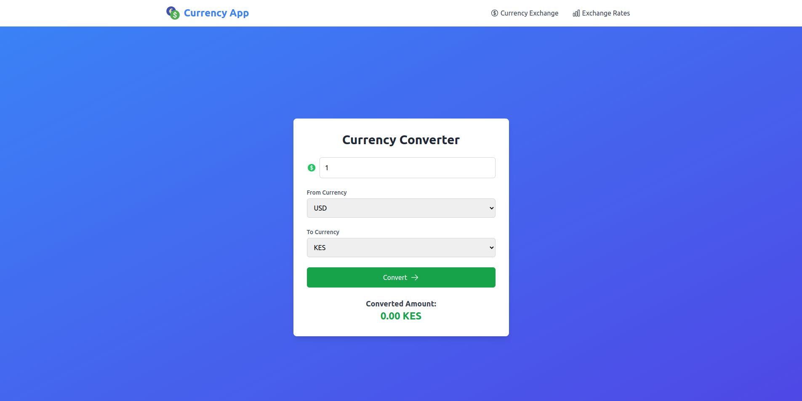

# Currency Converter App

## Overview

This is a simple React application that provides users with the ability to convert currencies and view current exchange rates. The app consists of two main components:

1. **CurrencyExchange**: Allows users to convert an amount from one currency to another.
2. **ExchangeRate**: Displays the current exchange rates for various currencies.

## Features

- currency conversion.
- Displays  exchange rates.
- Responsive and user-friendly interface.


## Technologies Used

- **React**: A JavaScript library for building user interfaces.
- **Axios**: For making HTTP requests to fetch exchange rate data.
- **Heroicons**: For using icons in the UI.
- **Tailwind CSS**: For styling the components.

## Installation

To run this application locally, follow these steps:

1. Clone the repository:

   ```bash
   git clone https://github.com/Caleb-ne1/react-currency-converter.git
   cd react-currency-converter
    ```

2. Install dependencies:

```bash
npm install
```

3. Start the development server:

```bash
npm start
```
Open your browser and navigate to http://localhost:3000.
